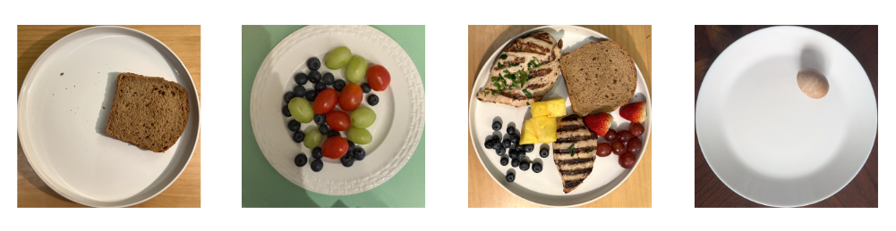
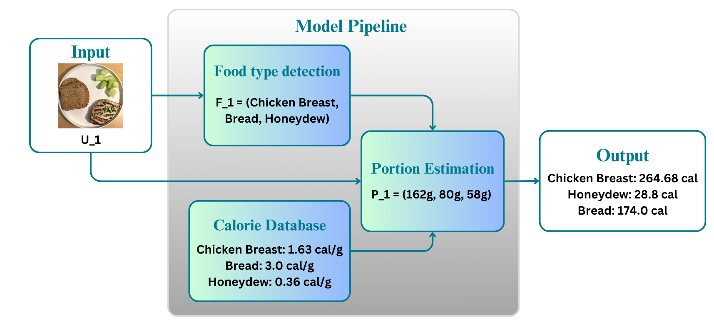

# CalorAI: The AI Calorie Estimator

## Introduction

Obesity is a growing global health crisis, with over 38% of the population classified as overweight or obese, contributing to numerous chronic conditions. Accurate tracking of caloric intake is essential for promoting healthier eating habits, yet existing diet apps often rely on manual input, which can be tedious and error-prone.

**CalorAI** aims to simplify this process using deep learning. By analyzing images of meals, CalorAI automatically classifies food items and estimates their calorie content. Our system uses a CNN-based pipeline to handle both food recognition and portion estimation. This project serves as a foundation for more advanced diet-tracking solutions and offers an open-source implementation for further research and real-world use.

---

## Data

Although many datasets map food images to categories and categories to calories, few offer direct mappings from food images to calorie values. This gap makes it difficult for models to learn **portion estimation** directly from images. To overcome this, we built our own dataset.

### Data Collection

We collected cell phone images in varied environments to simulate real-world usage. Images were taken on 10-inch plates with good contrast from the background and consistent framing (1:1 ratio). Each food item was weighed using a kitchen scale, and total calories were computed using a calorie-per-gram dataset. To ensure variety, food was photographed in different orientations, quantities, and combinations.

Our dataset contains 1093 labeled images across multiple food types.  

### Data Pre-processing

Images were resized to 400×400 pixels, converted to tensors, and normalized. Labels were converted to multi-label one-hot encodings. Each image is associated with the presence of specific food items, enabling multi-label classification and calorie estimation.

### Dataset Split by Food Category

| Food Category    | Total | Train | Validation | Test |
|------------------|-------|-------|------------|------|
| Pineapple        | 188   | 151   | 18         | 19   |
| Blueberries      | 182   | 146   | 20         | 16   |
| Strawberries     | 166   | 135   | 16         | 15   |
| Chicken Breast   | 159   | 129   | 15         | 15   |
| Cantaloupe       | 156   | 126   | 16         | 14   |
| Egg              | 102   | 84    | 9          | 9    |
| Bread            | 98    | 77    | 10         | 11   |
| Grapes           | 93    | 74    | 10         | 9    |
| Cherry Tomato    | 91    | 75    | 8          | 8    |
| Mushrooms        | 90    | 71    | 11         | 8    |
| Jujube           | 86    | 65    | 10         | 11   |
| Broccoli         | 83    | 70    | 8          | 5    |
| Honeydew         | 81    | 64    | 9          | 8    |
| Cauliflower      | 80    | 65    | 10         | 5    |
| Raisins          | 75    | 61    | 6          | 8    |
| Sweet Potato     | 65    | 52    | 7          | 6    |
| Garlic           | 64    | 51    | 5          | 8    |
| Apple            | 51    | 39    | 7          | 5    |
| Carrot           | 50    | 40    | 5          | 5    |
| Clementine       | 41    | 31    | 5          | 5    |
| Pear             | 33    | 27    | 2          | 4    |
| Chives           | 30    | 23    | 4          | 3    |
| Orange           | 23    | 20    | 2          | 1    |
| Banana           | 21    | 16    | 3          | 2    |
| Potato           | 20    | 18    | 0          | 2    |
| Onion            | 14    | 11    | 2          | 1    |
| **Total**        | 2432  | 1949  | 270        | 213  |

### Dataset Split by Number of Food Types

| Number of Food Types | Total | Train | Validation | Test |
|----------------------|-------|-------|------------|------|
| 1                    | 587   | 467   | 56         | 64   |
| 2                    | 212   | 172   | 21         | 19   |
| 3                    | 147   | 120   | 16         | 11   |
| 4                    | 82    | 63    | 10         | 9    |
| 5                    | 35    | 26    | 5          | 4    |
| 6                    | 24    | 22    | 0          | 2    |
| 7                    | 5     | 4     | 1          | 0    |
| 8                    | 1     | 1     | 0          | 0    |
| **Total**            | 1093  | 895   | 109        | 109  |

---

## CalorAI Model

### Task Definition

Given an input food image $U_i$, the model identifies the food items $F_i = (f_1, f_2, ..., f_j)$ on the plate and estimates their calorie content $C_i = (p_1, p_2, ..., p_j)$.

### Model Architecture

The model has three core components:

1. **Food Classification** – A multi-label ResNet18-based classifier that outputs probabilities across predefined food classes.
2. **Portion Estimation** – A CNN regression model that takes the image and detected food types and estimates the weight (in grams) of each.
3. **Calorie Computation** – A deterministic module that multiplies the estimated portions with calorie-per-gram values from a lookup table.

---

## Evaluation

We evaluate both the food classification and portion estimation components.

### Food Classification Metrics

- **F1 Score**: Balance between precision and recall.
- **Hamming Loss**: Fraction of misclassified labels.
- **Exact Match Ratio**: Proportion of fully correct label predictions.

### Portion Estimation Metrics

- **Mean Absolute Error (MAE)**: Average difference in grams between prediction and ground truth.
- **Root Mean Squared Error (RMSE)**: Emphasizes larger errors.
- **Accuracy within ±10%**: Percentage of predictions within 10% of the actual value.

### Current Performance

| **Food Classifier**       | Value   | **Portion Regressor**         | Value     |
|--------------------------|---------|-------------------------------|-----------|
| F1 Score                 | 0.7815  | MAE                           | 0.64g     |
| Hamming Loss             | 0.0243  | RMSE                          | 1.09g     |
| Exact Match Ratio        | 0.5439  | Accuracy (±10% range)         | 21.01%    |

As calorie output is computed from estimated weight, portion accuracy is the most critical metric for real-world utility.

### Baseline Testing

We also benchmarked various image classification models on our custom dataset using a 16GB RAM, NVIDIA RTX 3060 (6GB VRAM) setup.

| **Model**         | **Parameters** | **Test Accuracy (%)** |
|-------------------|----------------|------------------------|
| ResNet18          | 11.2M          | 88.78                  |
| ResNet26          | 14.0M          | 90.09                  |
| ResNet34          | 21.3M          | 88.57                  |
| ResNet50          | 23.6M          | 92.45                  |
| ViT-Tiny          | 5.6M           | 65.70                  |
| ViT-Small (16)    | 21.8M          | 69.44                  |
| ViT-Small (32)    | 22.5M          | 65.31                  |

---

## Next Steps

---

## Guide to Codebase

